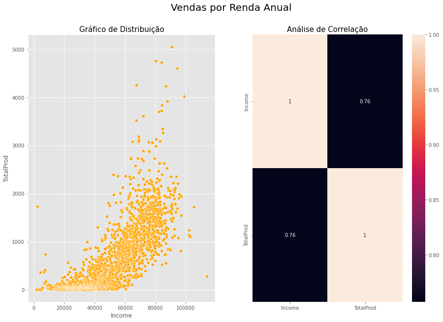

Esse é um projeto de análise de dados.

O conjunto de dados utilizado está disponível [neste link](https://www.kaggle.com/datasets/rodsaldanha/arketing-campaign)

# Entendimento do Negócio

A BestShop é uma empresa em expansão que comercializa produtos, principalmente alimentícios, através de lojas físicas e de maneira virtual.

Visando otimizar ainda mais suas vendas, a empresa contratou um consultor em ciência de dados para realizar a segmentação de seus clientes. O principal objetivo desse projeto é identificar padrões de consumo para realizar campanhas de Marketing customizadas e consequentemente mais assertivas, visto que atualmente, as taxas de conversão das campanhas são baixas.

Durante a reunião de negócios, vários métodos de como realizar a segmentação dos clientes foram debatidos. Ao final, foi decidido que para o primeiro ciclo do projeto, o cientista de dados deverá utilizar a análise RFM e assim, sugerir recomendações de ações para o time de Marketing.

# Dicionário de Dados

| Variáveis                        | Descrição                                                            |
| -------------------------------- | -------------------------------------------------------------------- |
| ID	                             | Identificação do cliente                                             |
| Year_Birth                       | Ano de nascimento                                                    |
| Education	                       | Nível educacional                                                    |
| Marital_Status	                 | Estado civil                                                         |
| Income                           | Renda familiar anual                                                 |
| Kidhome	                         | Número de crianças que moram na casa                                 |
| Teenhome	                       | Número de adolescentes que moram na casa                             |
| Dt_Customer	                     | Data que o consumidor se inscreveu na loja                           |
| Recency	                         | Número de dias desde a última compra do cliente                      |
| Complain	                       | 1 se o cliente reclamar nos últimos 2 anos, 0 caso contrário         |
| MntWines                         | Quantidade gasta em vinho nos últimos 2 anos                         |
| MntFruits                        | Quantidade gasta com frutas nos últimos 2 anos                       |
| MntMeatProducts                  | Quantidade gasta com carne nos últimos 2 anos                        |
| MntFishProduct	                 | Quantidade gasta em peixe nos últimos 2 anos                         |
| MntSweetProducts                 | Quantia gasta em doces nos últimos 2 anos                            |
| MntGoldProds	                   | Quantia gasta em ouro nos últimos 2 anos                             | 
| NumDealsPurchases	               | Número de compras feitas com desconto                                |
| AcceptedCmp1	                   | 1 se o cliente aceitou a oferta na 1° campanha, 0 caso contrário     |
| AcceptedCmp2	                   | 1 se o cliente aceitou a oferta na 2° campanha, 0 caso contrário     |
| AcceptedCmp3	                   | 1 se o cliente aceitou a oferta na 3° campanha, 0 caso contrário     |
| AcceptedCmp4	                   | 1 se o cliente aceitou a oferta na 4° campanha, 0 caso contrário     |
| AcceptedCmp5	                   | 1 se o cliente aceitou a oferta na 5° campanha, 0 caso contrário     |
| Response	                       | 1 se o cliente aceitou a oferta na última campanha, 0 caso contrário |
| NumWebPurchases	                 | Número de compras feitas por meio do site da empresa                 |
| NumCatalogPurchases	             | Número de compras feitas usando um catálogo                          |
| NumStorePurchases	               | Número de compras feitas diretamente nas lojas                       |
| NumWebVisitsMonth	               | Número de visitas ao site da empresa no último mês                   |     

# Estratégia da Solução

Como estratégia para a solução do projeto, definimos as seguintes etapas:

- **1. Entendimento do Negócio:** nesta etapa inicial, o principal objetivo é compreender o problema de negócio e as necessidades do cliente.

- **2. Entendimento dos Dados:** iremos tratar as principais inconsistências encontradas nos dados, e realizar uma análise exploratória a fim de gerar insights sobre o negócio.

- **3. Engenharia de Atributos:** com os dados existentes, criaremos variáveis a fim de extrair novas informações dos dados.

- **4. Perguntas e Hipóteses de Negócio:** ainda como forma de explorar os dados, criaremos perguntas e hipóteses relacionadas ao problema de negócio.

- **5. Análise RFM:** através da análise RFM, iremos segmentar os clientes da empresa.

- **6. Recomendações para Área de Marketing:** nessa etapa, iremos sugerir algumas recomendações para a área de Marketing.

# TOP 3 Insights

**H1. Em média, clientes mais jovens compram mais pela internet.**
- Falsa, podemos observar que os grupos 3 e 4 possuem as maiores médias de compra pela internet.
- 

**H4. Clientes "alta renda" compram mais.**
- Verdadeira, há uma alta correlação positiva entre a renda do cliente e o total de produtos comprados.
- 

**H6. Clientes antigos compram mais que clientes novos.**
- Falsa, não há nenhuma relação entre o tempo de vida do cliente com o total de compras realizadas.
- 

# Análise RFM

A análise RFM é uma estratégia para estimar o valor de um cliente, com base em três variáveis:

- **Recency (recência):** quanto mais recente tiver sido a última compra de um cliente, mais pontos ele recebe aqui.
- **Frequency (frequência):** quanto maior for o número de compras de um cliente, maior também será sua pontuação neste quesito.
- **Monetary (monetário):** quanto maior for o gasto do cliente em compras, maior a pontuação.

Após a análise, os clientes foram divididos em seis grupos, conforme a imagem abaixo.
- 

- **Ativo Especial:** clientes recentes que compram com muita frequência;
- **Ativo Normal:** clientes recentes que compram com menos frequência;
- **Em Atenção:** clientes que compram com muita frequência e que estão a algum tempo sem comprar;
- **Em Alerta:** clientes que compram com menos frequência e que estão a algum tempo sem comprar;
- **Recuperar Importantes:** clientes que compram com muita frequência e que estão a muito tempo sem comprar;
- **Recuperar Médios:** clientes que compram com menos frequência e que estão a muito tempo sem comprar.
